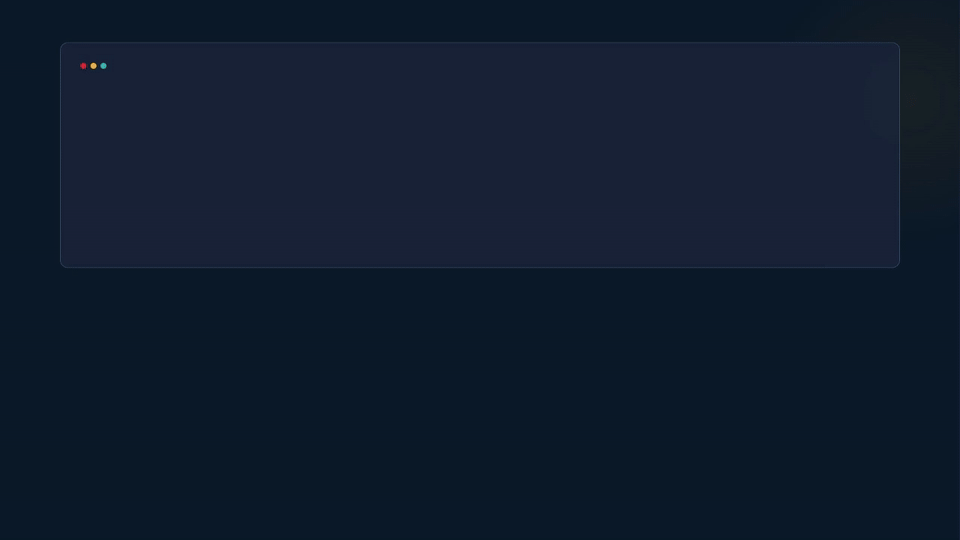

# owlwatch

<p align="center">
  
</p>

<p align="center">
  🦉 <strong>owlwatch</strong> — AI dev environment health check & system monitor
</p>

<p align="center">
  Pure bash · Zero deps · macOS & Linux
</p>

<p align="center">
  Works in terminal, Claude Code, Cursor, Windsurf, or any AI agent
</p>

---

## What it does

**owlwatch doctor** — 16-dimension dev environment health check. Scans your AI coding setup in seconds and scores it out of 100.

**owlwatch health** — System performance report. CPU, memory, disk, orphan process detection.

**owlwatch clean** — Safely kill orphan processes. Protected system processes never touched.

## Doctor — Dev Environment Check

```
$ owlwatch doctor
```

Scans 16 dimensions and outputs a scored report:

| Category | Dimensions |
|----------|-----------|
| **Core Setup** | Tools, Model Config, MCP Servers, Permissions |
| **Dev Workflow** | Hooks, Skills, Agents, Rules |
| **Project Health** | Memory, Project Context, Context Hygiene |
| **Infrastructure** | Terminal, Git, Security |
| **Efficiency** | Cost Efficiency (token overhead estimation), Workflow |

Each dimension scores **pass / warn / fail** with a color-coded progress bar.

```
$ owlwatch doctor             # Scored summary
$ owlwatch doctor --detail    # Per-dimension breakdown with sub-items
$ owlwatch doctor --json      # Structured JSON for scripts
$ owlwatch doctor --all       # Combined health + doctor report
```

### Workflow Dimension

The Workflow check goes beyond "does file exist?" — it assesses quality:

- **Plan flow** — CLAUDE.md planning instructions + planner agent
- **Task management** — TODO.md / STATE.md freshness
- **TDD loop** — Test framework + tdd-guide agent + testing rules
- **Code Review** — code-reviewer + security-reviewer coverage
- **Quality gates** — PreToolUse / PostToolUse / Stop hooks
- **Handoff** — Cross-session context files (AGENTS.md, CONTEXT.md)
- **Memory** — Learning loop (updates/decisions/lessons.md)
- **Git discipline** — Conventional commits + workflow rules
- **Rules** — Common rules coverage
- **Agents** — Key agent coverage (plan/tdd/review/arch)

### Cost Efficiency

Estimates total token overhead from skills, rules, and agents — so you know exactly how much context each conversation burns.

## Health — System Performance

```
$ owlwatch health
```

CPU top processes, memory usage, disk/swap/load stats, and orphan process detection.

## All Commands

```
owlwatch                          # Full health report (default)
owlwatch health                   # Same as above
owlwatch health --json            # JSON output
owlwatch doctor                   # Dev environment check — scored summary
owlwatch doctor --detail          # Per-dimension breakdown
owlwatch doctor --json            # Structured JSON
owlwatch doctor --all             # Combined health + doctor
owlwatch clean                    # Scan orphan processes (dry run)
owlwatch clean --yes              # Auto-clean all detected orphans
owlwatch clean --pid 12345        # Kill specific PID
owlwatch clean --name codex       # Kill all processes by name
owlwatch chrome                   # Chrome memory and extension analysis
owlwatch daemon install           # Install background auto-cleanup (macOS)
owlwatch daemon status            # Check daemon status
owlwatch daemon uninstall         # Remove daemon
```

## Quick Start

### Install

```bash
bash <(curl -fsSL https://raw.githubusercontent.com/bitoranges/owlwatch/main/install.sh)
```

Or clone and install:

```bash
git clone https://github.com/bitoranges/owlwatch.git
cd owlwatch
bash install.sh
```

### Run

```bash
owlwatch doctor          # Check your dev environment
owlwatch health          # Check system performance
```

### Install with AI integration

```bash
bash install.sh --claude         # Install as Claude Code skill
bash install.sh --cursor         # Print Cursor rules setup instructions
bash install.sh --windsurf       # Print Windsurf rules setup instructions
bash install.sh --claude --cursor --windsurf  # All of the above
```

### Uninstall

```bash
bash install.sh --uninstall
```

## Configuration

Config file: `~/.local/share/owlwatch/conf/owlwatch.conf`

```bash
# Thresholds
CPU_WARN_THRESHOLD=70        # CPU alert %
MEM_WARN_THRESHOLD=80        # Memory alert %
DISK_WARN_THRESHOLD=85       # Disk alert %

# Orphan detection
ORPHAN_CPU_THRESHOLD=50      # Min CPU% to count as orphan
ORPHAN_MIN_RUNTIME=30        # Min runtime in minutes
ORPHAN_PATTERNS="codex claude-mem-codex-watcher"

# Protected processes (never killed)
PROTECT_NAMES="kernel_task WindowServer loginwindow launchd syslogd"

# Daemon interval
DAEMON_INTERVAL=1800         # 30 minutes
```

Override with environment variables using `OW_` prefix:

```bash
export OW_CPU_WARN_THRESHOLD=90
export OW_ORPHAN_PATTERNS="codex node python"
```

## AI Agent Integration

owlwatch ships adapter files for popular AI coding tools. The installer handles setup automatically.

### Claude Code

```bash
bash install.sh --claude
```

Then use `/owlwatch` in Claude Code, or say "check system", "doctor", "dev environment", etc.

### Cursor / Windsurf

```bash
bash install.sh --cursor    # Print Cursor rules
bash install.sh --windsurf   # Print Windsurf rules
```

### Other AI agents

owlwatch is a plain CLI tool — any agent that can run shell commands can use it.

## Architecture

```
owlwatch/
├── bin/
│   ├── owlwatch                # Unified CLI entry point (router)
│   ├── owlwatch-health.sh      # System health report
│   ├── owlwatch-doctor.sh      # Dev environment check
│   ├── owlwatch-clean.sh       # Process cleanup
│   ├── owlwatch-chrome.sh      # Chrome analysis
│   └── owlwatch-daemon.sh      # Daemon management
├── lib/
│   ├── common.sh               # Config, logging, formatting, OS detection
│   ├── process.sh              # Process analysis, orphan detection, process tree
│   ├── memory.sh               # Memory, disk, load average
│   ├── chrome.sh               # Chrome extensions and memory
│   └── doctor.sh               # 16-dimension dev environment checks
├── conf/
│   └── owlwatch.conf.example   # Example config
├── adapters/
│   ├── claude-code.md          # Claude Code skill definition
│   ├── cursor.md               # Cursor rules template
│   └── windsurf.md             # Windsurf rules template
├── install.sh                  # Installer
├── LICENSE                     # MIT
└── README.md
```

## Requirements

- bash 3.2+
- macOS or Linux
- No external dependencies

## License

MIT
